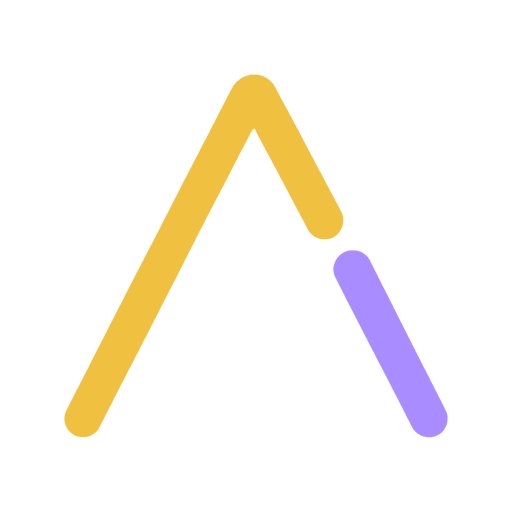

<p align="center">
  <a href="https://sigilcoin.lol">
    
  </a>
</p>

<h1 align="center">SigilCoin</h1>

<p align="center">
  <strong>Short programs. Better odds.</strong><br>
  An experimental blockchain where blocks are mined by program golf.
</p>

<p align="center">
  <a href="https://github.com/trevarj/sigil-coin/releases"></a>
  <a href="docs/consensus.md"></a>
  <a href="https://usesigil.org"></a>
  <a href="package.sgl"></a>
  <a href="https://github.com/trevarj/sigil-coin/commits/master"></a>
</p>

<p align="center">
  <a href="https://sigilcoin.lol"><strong>Website</strong></a> ·
  <a href="https://explorer.sigilcoin.lol"><strong>Mainnet explorer</strong></a> ·
  <a href="https://explorer.testnet.sigilcoin.lol"><strong>Testnet explorer</strong></a> ·
  <a href="docs/whitepaper.md"><strong>Whitepaper</strong></a> ·
  <a href="docs/consensus.md"><strong>Consensus</strong></a> ·
  <a href="docs/deployment.md"><strong>Run a node</strong></a>
</p>

---

SigilCoin is a for-fun blockchain written in [Sigil](https://usesigil.org) and built on the [`sigil-bitcoin`](https://github.com/trevarj/sigil-bitcoin) libraries. Instead of hash grinding alone, every block presents a deterministic programming puzzle. Miners submit a valid program, and shorter programs receive better odds in the block-header lottery.

> [!IMPORTANT]
> SigilCoin is experimental software. SGL is intended to have no monetary value. There is no premine, no sale, no bridge, and no promise of future value. Do not use funds or infrastructure you cannot afford to lose.

## How mining works

1. Every node derives the same input/output examples and syntactic constraint from the parent block.
2. A miner submits a program no longer than the generated par solution.
3. Each byte saved below par doubles the accepted hash range, up to an eight-byte (`256x`) bonus.
4. The miner searches the coinbase lock-time/header-nonce cursor until the full 80-byte header's `HASH256` roll qualifies.
5. Nodes validate the program, resource limits, block body, lottery target, and cumulative base work independently.

Program length changes admission odds, not credited chain work. Fork choice follows cumulative compact-target base work, then height, then first-seen order for an exact tie.

## Network

| Parameter | Mainnet |
|---|---|
| Status | Live, experimental |
| DNS seed | `seed.sigilcoin.lol:19444` |
| Explorer | [explorer.sigilcoin.lol](https://explorer.sigilcoin.lol) |
| Address prefix | `sgl1…` |
| Target cadence | About one block per day |
| Initial target | `0x1c2bcf04` |
| Genesis time | `2026-09-12T16:00:00Z` |
| Genesis ID | `000000000b25af1072272ae97b606d64b340fc8f61f78f04c3e794025832b969` |
| Maximum block size | 16 KiB |
| Maximum solution size | 512 bytes |

Public testnet uses `seed.testnet.sigilcoin.lol:19446`, [`explorer.testnet.sigilcoin.lol`](https://explorer.testnet.sigilcoin.lol), and `tsgl1…` addresses. Testnet coins and keys are disposable and must never be reused on mainnet.

## Components

| Package | Responsibility |
|---|---|
| [`sigil-coin-puzzle`](packages/sigil-coin-puzzle) | Frozen puzzle language, interpreter, and deterministic generator |
| [`sigil-coin-consensus`](packages/sigil-coin-consensus) | Emission, solution rules, payouts, and deterministic retarget formulas |
| [`sigil-coin-node`](packages/sigil-coin-node) | Chain configuration, header rules, fork choice, and node runtime on `sigil-bitcoin-node` |
| [`sigil-coin-cli`](packages/sigil-coin-cli) | The `sigilcoin` wallet, node, puzzle, and mining CLI |
| [`sigil-coin-explorer`](packages/sigil-coin-explorer) | Read-only HTML and JSON explorer |
| [`sigil-coin-site`](packages/sigil-coin-site) | Deterministic static website generator |

Consensus-critical code is deliberately direct and boring. Interpreter divergence is a chain split.

## Getting started

### Development checkout

The development flake currently uses the Sigil and `sigil-bitcoin` sibling checkouts. Place all three repositories next to one another:

```text
workspace/
├── sigil/
├── sigil-bitcoin/
└── sigil-coin/
```

Enter the pinned Nix environment with those local sources:

```sh
nix develop \
  --override-input sigil path:../sigil \
  --override-input sigil-bitcoin path:../sigil-bitcoin

sigilcoin version
```

The shell supplies the Sigil compiler, C toolchain, secp256k1, and the built `sigilcoin` and `sigilcoin-explorer` commands. No global packages are required.

### Create a wallet

Keep a mainnet wallet on your personal machine, not on a public seed:

```sh
install -d -m 0700 "$HOME/.sigilcoin-main"

sigilcoin address \
  --chain sigilcoin-main \
  --data-dir "$HOME/.sigilcoin-main"
```

The command creates `wallet/wallet.key` with mode `0600`. That 32-byte key is the wallet: there is no seed phrase or recovery service. Back it up encrypted and offline before receiving rewards. Never commit it, paste it into chat, or place it in the Nix store.

### Sync and inspect the puzzle

```sh
sigilcoin sync \
  --chain sigilcoin-main \
  --data-dir "$HOME/.sigilcoin-main"

sigilcoin puzzle \
  --chain sigilcoin-main \
  --data-dir "$HOME/.sigilcoin-main"
```

### Mine

`sigilcoin puzzle` prints the guaranteed par witness. When `--solution` is
omitted, `sigilcoin mine` uses that witness and immediately begins searching.
Use the wallet address created above explicitly:

```sh
PAYOUT_ADDRESS=$(
  sigilcoin address \
    --chain sigilcoin-main \
    --data-dir "$HOME/.sigilcoin-main" |
  sed -n 's/^address: //p'
)

sigilcoin mine \
  --address "$PAYOUT_ADDRESS" \
  --chain sigilcoin-main \
  --data-dir "$HOME/.sigilcoin-main"
```

For the guarded, restart-safe Docker miner, see [Automatic mainnet mining](docs/deployment.md#automatic-mainnet-mining).

## Build and test

From the development shell above, install or refresh dependencies and run the
suite:

```sh
sigil deps install --redirects ./dev-redirects.sgl
sigil test --redirects ./dev-redirects.sgl --no-color
```

Check the root package and deployment module with the same sibling sources:

```sh
nix flake check \
  --override-input sigil path:../sigil \
  --override-input sigil-bitcoin path:../sigil-bitcoin

nix flake check 'path:.?dir=deploy' \
  --override-input sigil path:../sigil \
  --override-input sigil-bitcoin path:../sigil-bitcoin
```

See [`AGENTS.md`](AGENTS.md) for repository conventions and exact focused-test commands.

## Documentation

- [Whitepaper](docs/whitepaper.md) — design, incentives, limitations, and rationale
- [Consensus specification](docs/consensus.md) — normative formulas, encodings, and validation rules
- [Deployment guide](docs/deployment.md) — Docker, exposure gates, backups, and automatic mining
- [Operator runbook](deploy/RUNBOOK.md) — NixOS service operation and incident handling
- [Public testnet guide](docs/testnet.md) — reset boundary, relay, and testnet operations
- [Simulation notes](docs/simulation.md) — deterministic puzzle, payout, and strategy experiments
- [Launch record](LAUNCH.md) — calibration, genesis proof, rehearsal evidence, and launch gates

## Security and consensus

Changes to the puzzle interpreter, generator, emission, solution rules, target calculation, block validation, or fork choice are consensus changes. A node running different rules may diverge silently.

Report reproducible defects through [GitHub Issues](https://github.com/trevarj/sigil-coin/issues). Never include wallet keys, unrevealed solutions, commitment blinds, or private deployment data.

## License

SigilCoin is available under the BSD 3-Clause license, as declared by the workspace and package manifests.
